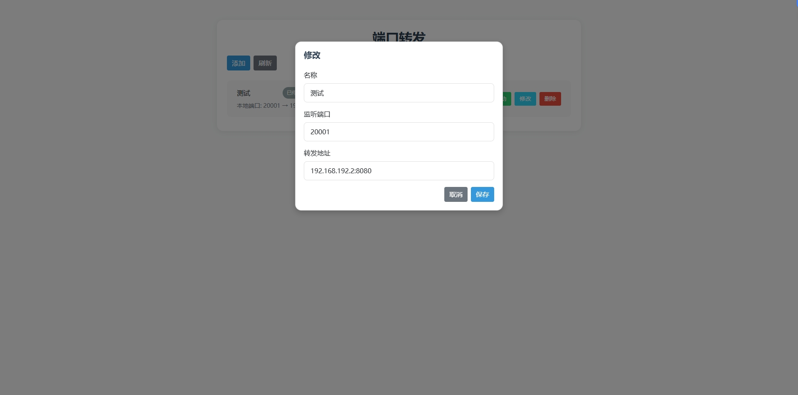

## Forward
* 端口转发工具
* 监听本地端口,并转发数据到指定地址

## 如何使用
* Windows桌面端
  [点击下载](https://github.com/injoyai/forward/releases/latest/download/forward-win-amd64.exe)
* Docker部署
  ```shell
    docker run -d \
    --name forward \
    --restart always \
    --network=host \
    -v /path/config:/root/config \
    -v /path/data:/root/data \
    injoyai/forward-amd64:latest
  ```
  
## 界面

#### 列表

#### 添加/修改

#### 启用/禁用

#### 错误信息
